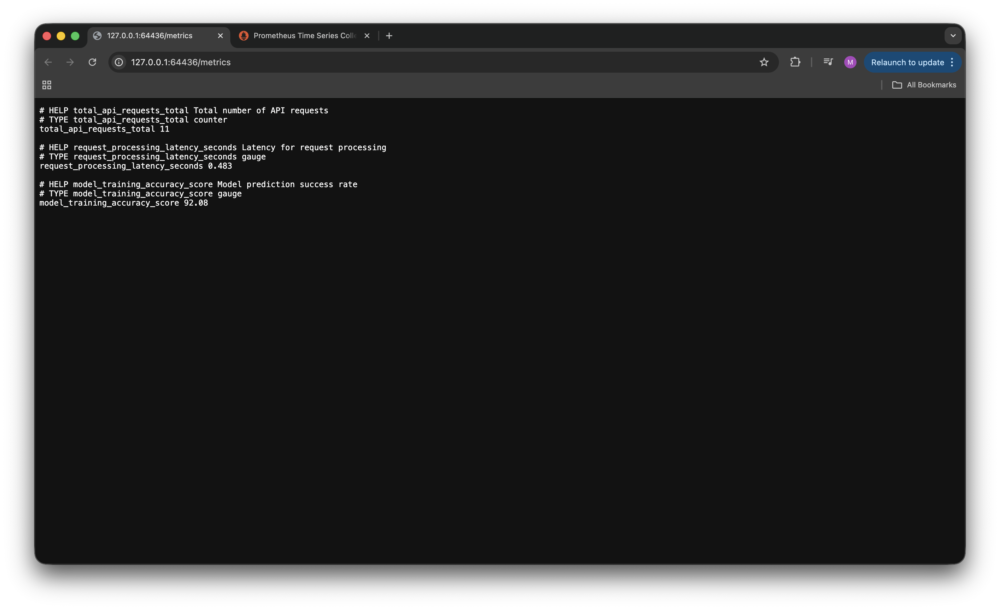
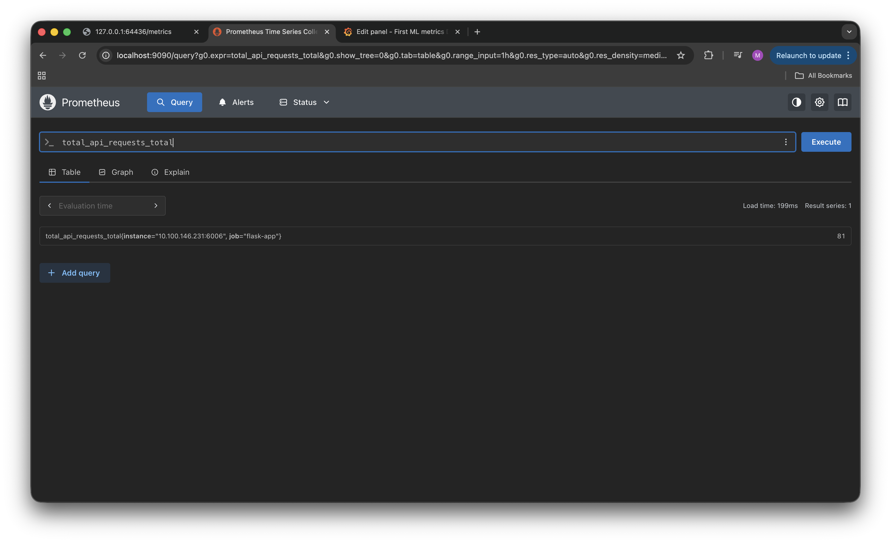
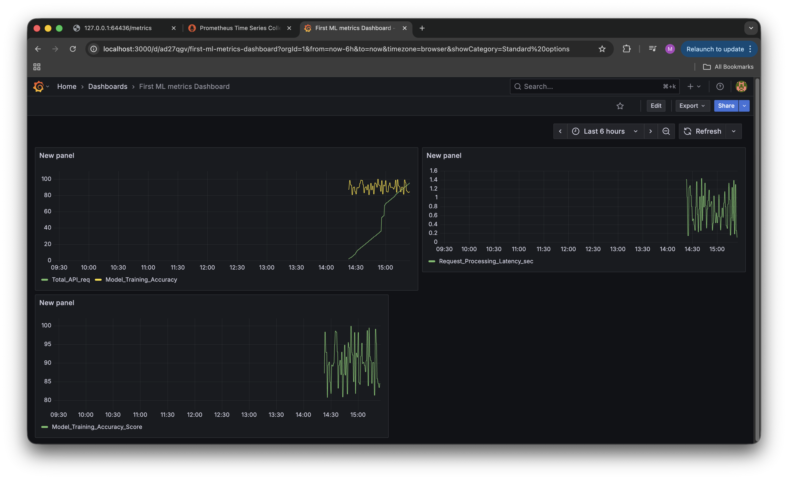

## 🚀 **End-to-End ML Observability Stack**


This project builds a complete, production-style monitoring stack for a machine learning application. It uses a **Flask** app to expose metrics, which is then containerized by **Docker** and deployed on **Kubernetes** (Minikube). The entire stack is monitored using **Prometheus** for data scraping and **Grafana** for visualization.
***

### 🛠️ **Key Learning Objectives**

* **Full Observability Stack**: Learning to implement a complete setup from metrics exposure (Flask) to collection (Prometheus) and visualization (Grafana).
* **Kubernetes Deployment**: Gaining experience deploying a containerized service on Minikube, simulating a production-ready environment.
* **Declarative Infrastructure**: Using Kubernetes manifests (`flask-app.yaml`) and Helm charts for a reproducible, easy-to-replicate setup.
* **Service Isolation**: Understanding the importance of namespaces by deploying Prometheus and Grafana into a separate `monitoring` namespace.
* **Custom Scrape Configuration**: Practiced the manual modification of the Prometheus `ConfigMap` to include a new scrape target.

***

### 🧠 **Architectural Workflow**

The workflow begins with the **Flask Application** (`app.py`). This is a simulated ML application that exposes custom metrics (like `total_api_requests_total`) on a `/metrics` endpoint.

This application is containerized using **Docker** and deployed onto a **Kubernetes (Minikube)** cluster using the `flask-app.yaml` manifest. This manifest creates a `Deployment` to run the app and a `Service` to expose it inside the cluster.

**Prometheus** is installed via Helm into its own `monitoring` namespace, separate from the application. It is configured to scrape the Flask app's `/metrics` endpoint by manually adding the app's service address to the Prometheus `ConfigMap`.

**Grafana** is also installed via Helm into the `monitoring` namespace. It connects to Prometheus using its internal cluster DNS name (`http://prometheus-server.monitoring.svc.cluster.local:80`) as a data source, allowing us to build dashboards to visualize the collected metrics.

***

### 📊 **Monitoring in Action**

#### **1. Application Metrics Endpoint**
> The `/metrics` page of the Flask app, exposing custom counters for Prometheus to scrape.


#### **2. Prometheus Targets**
> The Prometheus UI showing the status of all scrape targets, including the newly added `flask-app`.


#### **3. Grafana Dashboard**
> The final Grafana dashboard visualizing the application's metrics (e.g., API requests) in real-time.


***

### 📈 **Accessing the Monitoring Stack**

After deployment, the services are not exposed publicly by default. Use `kubectl port-forward` to access them on your `localhost`.

| Service | Namespace | Command | Access URL |
| :--- | :---: | :--- | :--- |
| **Prometheus** | `monitoring` | `kubectl port-forward -n monitoring svc/prometheus-server 9090:80` | `http://localhost:9090` |
| **Grafana** | `monitoring` | `kubectl port-forward svc/grafana -n monitoring 3000:80` | `http://localhost:3000` |
| **Flask App** | `default` | `minikube service ml-metrics-flask-app --url` | (URL provided by command) |

#### **Grafana Credentials**

* **Username**: `admin`
* **Password**: Run the command shown on terminal to retrieve the auto-generated password:
   

***

### ⚙️ **Tech Stack**

* **Application**: `Flask`, `Python`
* **Containerization**: `Docker`
* **Orchestration**: `Kubernetes (Minikube)`
* **Monitoring**: `Prometheus`
* **Visualization**: `Grafana`
* **Package Management**: `Helm`

***

### ▶️ **How to Reproduce**

Here is the step-by-step process to build and deploy the entire stack.

#### **1. Deploy the Application**

First, start Minikube, build the Docker image, load it into the cluster, and apply the Kubernetes manifest.

```sh
# Start your local Kubernetes cluster
minikube start

# Build the docker image
docker build -t ml-metrics-flask-app:latest .

# Load the image into Minikube's context
minikube image load ml-metrics-flask-app:latest

# Deploy the application
kubectl apply -f flask-app.yaml
````

#### **2. Install Monitoring Stack (Helm)**

Next, add the required Helm repositories and install Prometheus and Grafana into their own `monitoring` namespace.

```sh
# Add Helm repos
helm repo add prometheus-community [https://prometheus-community.github.io/helm-charts](https://prometheus-community.github.io/helm-charts)
helm repo add grafana [https://grafana.github.io/helm-charts](https://grafana.github.io/helm-charts)
helm repo update

# Install Prometheus
helm install prometheus prometheus-community/prometheus --namespace monitoring --create-namespace

# Install Grafana
helm install grafana grafana/grafana -n monitoring --create-namespace
```

#### **3. Configure Prometheus**

This is a manual step to make Prometheus aware of the Flask application.

1.  **Find your app's ClusterIP and Port:**

    ```sh
    kubectl get svc ml-metrics-flask-app
    # Note the CLUSTER-IP and PORT (e.g., 10.100.146.231 and 6006)
    ```

2.  **Edit the Prometheus ConfigMap:**

    ```sh
    kubectl edit configmap prometheus-server -n monitoring
    ```

3.  **Add the Scrape Job:** This will open a text editor. Scroll down to `scrape_configs:` and add the following new job (replacing the IP and Port with your own from step 1).

    ```yaml
    # ... existing scrape_configs ...
    - job_name: 'flask-app'
      static_configs:
        - targets: ['10.100.146.231:6006'] # <-- REPLACE THIS with your app's IP:PORT
    ```

4.  **Restart the Prometheus Deployment** to apply the changes:

    ```sh
    kubectl rollout restart deployment prometheus-server -n monitoring
    ```

#### **4. Configure Grafana**

Finally, access Grafana and point it to the Prometheus data source.

1.  **Access Grafana** using the command from the "Accessing" section:

    ```sh
    kubectl port-forward -n monitoring svc/grafana 3000:80
    ```

2.  **Log In** at `http://localhost:3000`:

      * **Username:** `admin`
      * **Password (get from CLI):**
        ```sh
        kubectl get secret --namespace monitoring grafana -o jsonpath="{.data.admin-password}" | base64 --decode ; echo
        ```

3.  **Add Prometheus as a Data Source:**

      * Navigate to the gear icon ⚙️ (`Configuration`) \> `Data Sources`.
      * Click `Add data source` and select `Prometheus`.
      * Set the **HTTP \> URL** to Prometheus's internal cluster address:
        `http://prometheus-server.monitoring.svc.cluster.local:80`
      * Click `Save & Test`. You can now build dashboards.

***

### 🚀 **Future Scope**

The next step for this project is to apply this same monitoring stack to a real-world machine learning application. The goal would be to implement:
**Monitoring:** Capturing all the meaningful metrics in real-time.
**Alerting:** Settingup Alerting system from grafana or using Alertmanager to notify when there is a problem.
**Visualizing:** Visualising the real metrics to monitor and maintain healthy ML systems. :)

***
*Note: Some Parts of this README were generated with assistance from GenAI.*